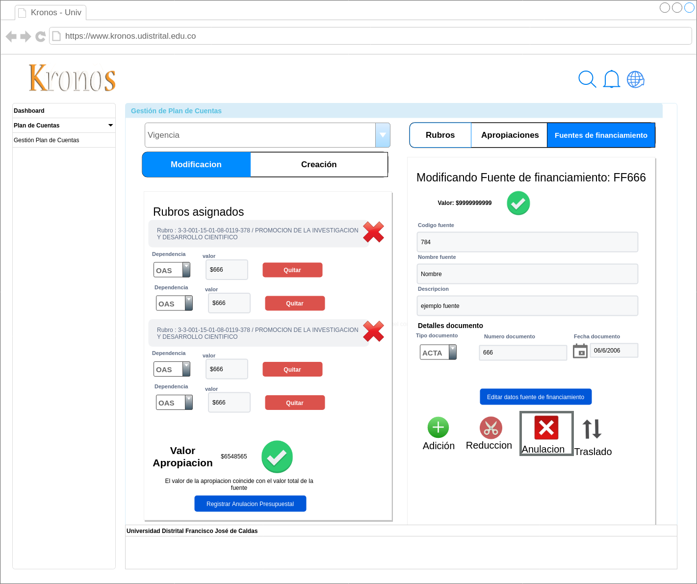

# Mockups movimientos presupuestales
para los movimientos presupuestales a nivel de fuentes de financiamineto se definieron los siguinetes mockups:
- Adicion en fuentes de financiamiento

- Anulacion en fuentes de financiamiento

- Reduccion en fuentes de financiamiento

- Traslado en fuentes de financiamiento
