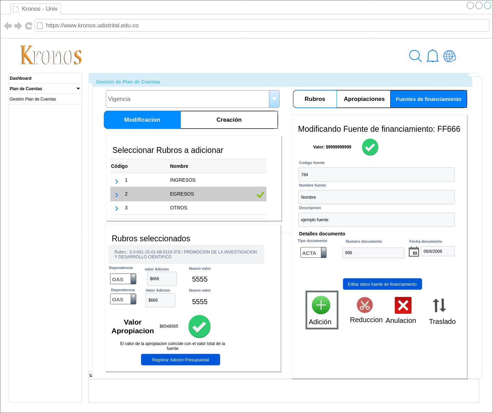
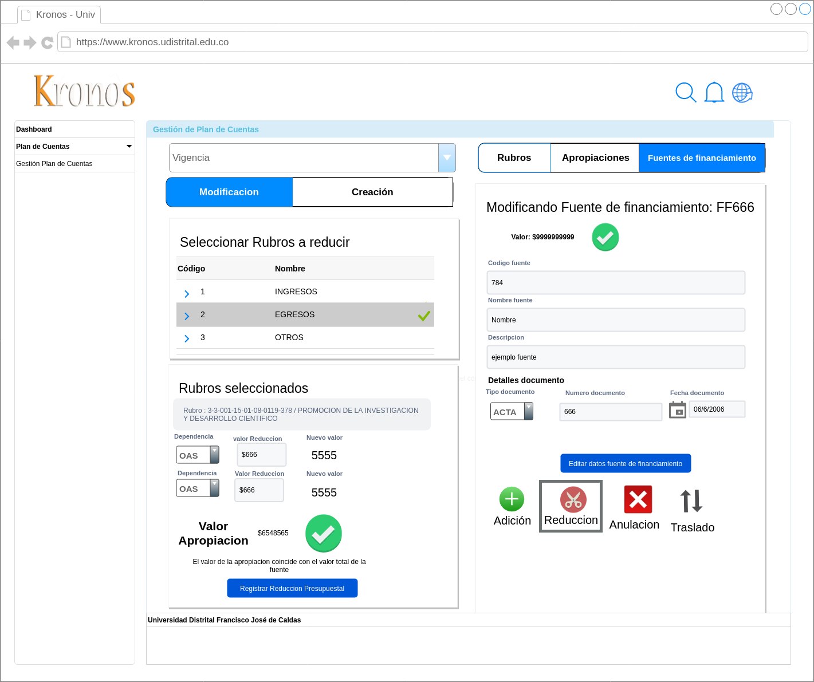
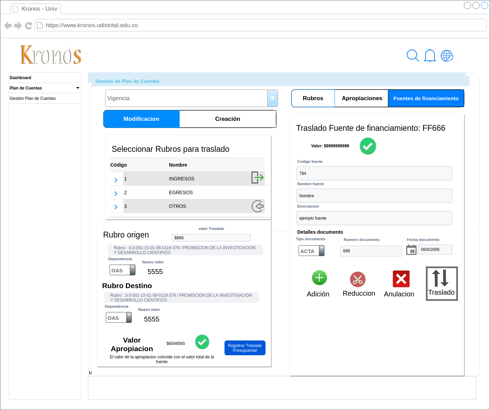
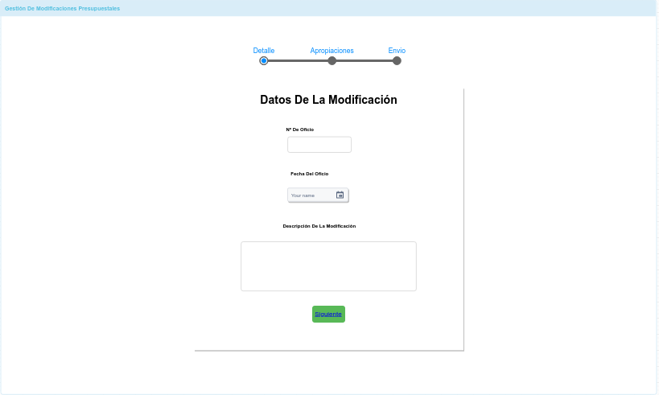
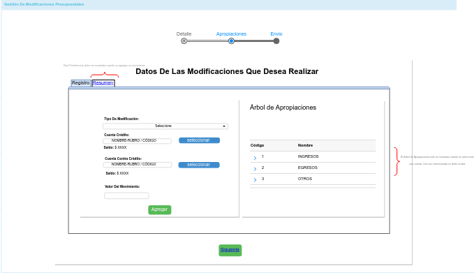
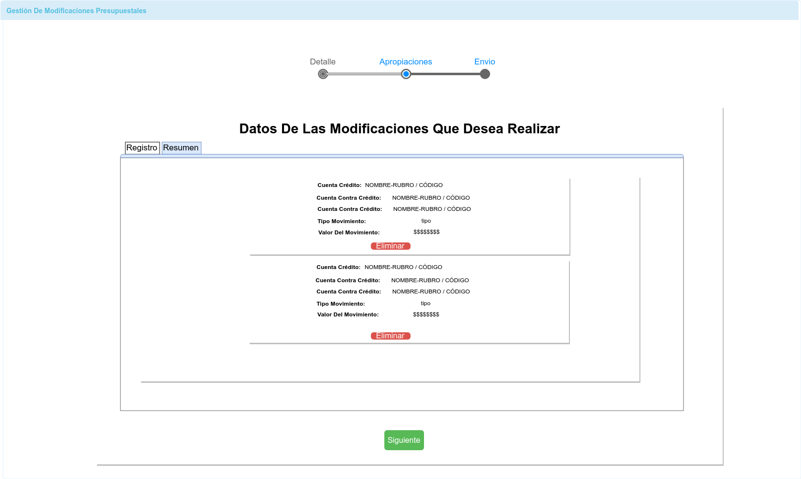
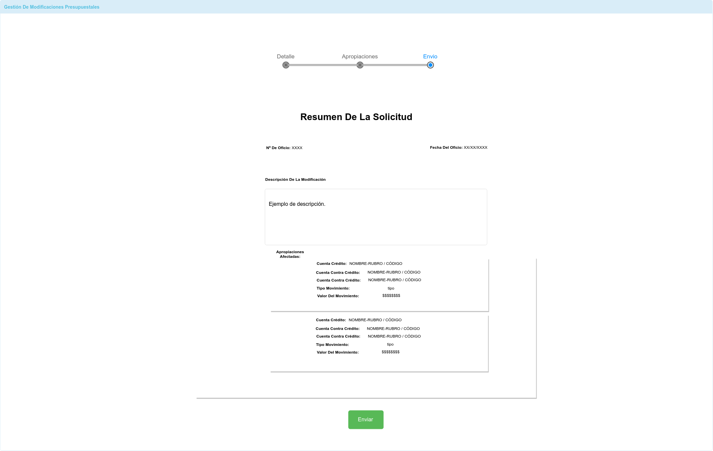
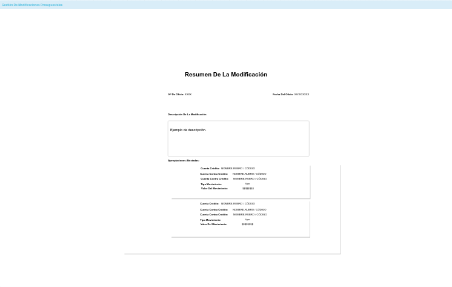

# Mockups movimientos presupuestales
para los movimientos presupuestales a nivel de fuentes de financiamineto se definieron los siguinetes mockups:
- Adicion en fuentes de financiamiento

- Reduccion en fuentes de financiamiento

- Traslado en fuentes de financiamiento

- Suspension en fuentes de financiamiento

- Registro Solicitud: Detalle

- Registro Solicitud: Apropiación

- Registro Solicitud: Apropiación (resumen)

- Registro Solicitud: Envio

- Lista Solicitudes

- Resumen Solicitud

