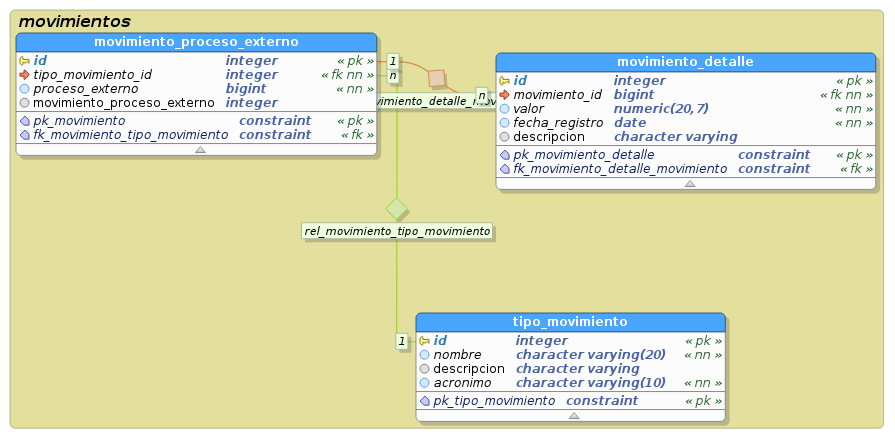

# Modelo de datos Movimientos 

para los movimientos se definio el siguiente modelo de datos para persistencia en postgres:

## Tablas:

### Movimiento Proceso externo
Entidad que identifica todos los  diferentes movimientos para procesos externos

- **Columnas**
- movimiento_proceso_externo.id: identificador de la tabla movimiento_proceso_externo

- movimiento_proceso_externo.tipo_movimiento_id: campo que relaciona a la tabla de tipo de movimiento

- movimiento_proceso_externo.proceso_externo: identificador del proceso al que hace referencia este movimiento, por ejemplo apropiaciones, adiciones, traslados, suspensiones, etc

- movimiento_proceso_externo.movimiento_proceso_externo: Campo que hace referencia cuando un movimiento involucra más de un ente externo 

COMMENT ON CONSTRAINT pk_movimiento ON movimientos.movimiento_proceso_externo : Llave primaria de la entidad movimiento

- **Restricciones**
- CONSTRAINT fk_movimiento_tipo_movimiento FOREIGN KEY (tipo_movimiento_id)
REFERENCES movimientos.tipo_movimiento (id)
### Movimiento detalle
Entidad que recibe la información detallada de cada movimiento

- **Columnas**
- movimiento_detalle.id: identificador de la tabla movimiento_detalle

- movimiento_detalle.movimiento_id: identificador que relaciona la entidad de movimiento

- movimiento_detalle.valor: valor que corresponda a un movimiento

- movimiento_detalle.fecha_registro: fecha en la que se registra el movimiento

- movimiento_detalle.descripcion: descripcion del movimiento

- **Restricciones**
- CONSTRAINT fk_movimiento_detalle_movimiento FOREIGN KEY (movimiento_id)
REFERENCES movimientos.movimiento_proceso_externo (id) 

### Tipo Movimiento
Entidad que se encarga de definir los tipos de movimientos de cada proceso

- **Columnas**
- tipo_movimiento.id: identificador de la tabla tipo_movimiento

- tipo_movimiento.nombre: nombre del tipo de movimiento

- tipo_movimiento.descripcion: descripcion detallada del tipo de movimiento

- tipo_movimiento.acronimo: Acronimo que pueda identificar y se relacione con el nombre del tipo_movimiento

- **Restricciones**

- CONSTRAINT pk_tipo_movimiento ON movimientos.tipo_movimiento : Llave primaria de la entidad tipo_movimiento