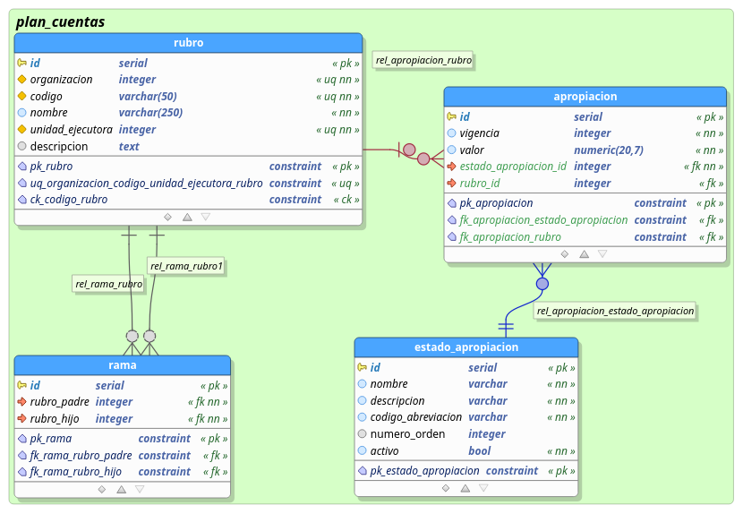

# Modelo de datos Apropiaciones

para las apropiaciones se definio el siguiente modelo de datos conectado al modelo de rubros:

## Tablas:

### Apropiacion

tabla que registra las apropiaciones iniciales para los rubros. se incluyeron las columnas:

- apropiacion.id  identificador de la apropiacion

- apropiacion.vigencia  año de la vigencia a la que pertenece la apropiacion

- apropiacion.valor  valor en moneda de la apropiacion

### Estado Apropiacion

- estado_apropiacion: tabla parametrica que registra los estados de las apropiaciones

- estado_apropiacion.id: identificador único del estado de la apropiacion

- estado_apropiacion.nombre: nombre del estado de la apropiacion que sera visible

- estado_apropiacion.descripcion: descripcion del estado de la apropiacion

- estado_apropiacion.codigo_abreviacion: acronimo del nombre del estado de la apropiación

- estado_apropiacion.numero_orden: por si es necesario establecer una orden a los registros que no se encuentren definidos