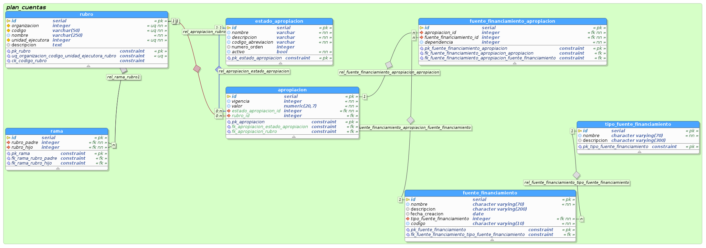

# Modelo de datos Fuentes de Financiamiento

para las fuentes de financiamiento se definio el siguiente modelo de datos para persistencia en postgres:

## Tablas:

### fuente_financiamiento 

almacena la informacion de las fuentes de financiamiento

- **Columnas**

- fuente_financiamiento.id : Llave primaria de la tabla fuente_financiamiento

- fuente_financiamiento.nombre : Nombre de la fuente de financiamiento

- fuente_financiamiento.descripcion : Una descripción de la fuente de financiamiento

- fuente_financiamiento.fecha_creacion : Fecha de la creación de la fuente de financiamiento

- fuente_financiamiento.tipo_fuente_financiamiento : Tipo de la fuente de financiamiento

- fuente_financiamiento.codigo : Codigo de la fuente de financiamiento 

- **Restricciones**

- CONSTRAINT pk_fuente_financiamiento ON - fuente_financiamiento : Primary Key de la tabla fuente_financiamiento

### fuente_financiamiento_apropiacion 

- fuente_financiamiento_apropiacion : Tabla que relaciona una fuente de financiamiento con una apropiación

- **Columnas**

- fuente_financiamiento_apropiacion.id : Primary key de la tabla fuente_financiamiento_apropiacion

- fuente_financiamiento_apropiacion.apropiacion_id : Fk referencia a la tabla apropiacion

- fuente_financiamiento_apropiacion.fuente_financiamiento_id : Fk fuente de financiamiento

- fuente_financiamiento_apropiacion.dependencia : Id de la dependencia a la cual va destinada el dinero del rubro obtenido a partir de la fuente de financiamiento

- **Restricciones**

- pk_fuente_financiamiento_apropiacion : primary key de la tabla fuente de financiamiento
