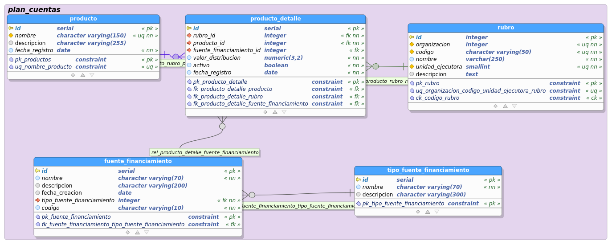

# Modelo de datos Productos

para los productos se definio el siguiente modelo de datos para persistencia en postgres:

## Tablas:

### producto 

almacena la informacion de los productos

- **Columnas**

- producto.id : Llave primaria de la tabla producto

- producto.nombre : nombre del producto a asociar

- producto.descripcion : Una descripción del producto

- producto.fecha_registro : fecha en la que se registro el producto

- **Restricciones**

- CONSTRAINT pk_productos ON - producto : Primary Key de la tabla producto

### producto_detalle 

tabla compuesta para referenciar las operaciones de los productos

- **Columnas**

- producto_detalle.id : identificador de la tabla producto_detalle

- producto_detalle.rubro_id : referencia al rubro que asocia al producto

- producto_detalle.producto_id : referencia al producto asociado a un rubro

- producto_detalle.fuente_financiamiento_id : referencia opcional a la tabla fuente_financiamiento

- producto_detalle.valor_distribucion : Valor asignado en porcentaje por cada producto para el rubro asociado a este mismo

- producto_detalle.activo : determina si el paramertro se encuentra activo para Determina si el parametro se encuentra activo para realizar calculos

- producto_detalle.fecha_registro : fecha en la que se registro la distribucion

- **Restricciones**

- pk_producto_detalle : llave primaria de la tabla producto_detalle;

