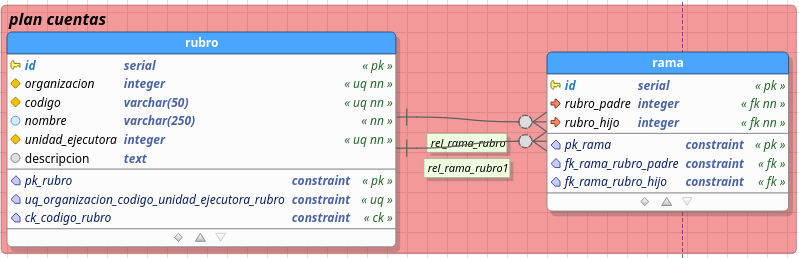

# Modelo de datos rubros

para los rubros se definio el siguiente modelo de datos para persistencia en postgres:

## Tablas:

### Rubro 

la tabla rubro almacena la informacion de los rubros (nodos del arbol de rubros)

- **Columnas**

- Rubro.id: identificador de la tabla rubro

- Rubro.organizacion: codigo identificador de la entidad  del distrito para el rubro

- Rubro.codigo: codigo del rubro de la forma 0-0-0-0... donde se utilizan numeros identificadores para los ancestros del rubro separados por guiones y el ultimo digito es el codigo perteneciente al rubro

- Rubro.nombre: nombre del rubro

- Rubro.unidad_ejecutora: unidad ejecutora para el rubro

- Rubro.descripcion: descripcion adicional del rubro suministrada por el funcionario durante el proceso de registro de rubro

- **Restricciones**

- CONSTRAINT pk_rubro ON plan_cuentas.rubro : restriccion llave primaria de rubro

- CONSTRAINT uq_organizacion_codigo_unidad_ejecutora_rubro ON plan_cuentas.rubro : restriccion creada para que dentro de la organizacion (entidad del distrito) y a su vez dentro de la unidad ejecutora no puedan existir 2 rubros con un mismo codigo, sin embargo pudiendo existir rubros con el mismo codigo en unidades u organizaciones diferentes.

- CONSTRAINT ck_codigo_rubro ON plan_cuentas.rubro : este check se encarga de que los codigos esten restringidos a la forma de 1 a 8 secuencias de digitos 999 separados por guiones -

### Rama 

- Rama: rama almacena relaciones entre los rubros: 

- **Columnas**

- Rama.id: identificador de la tabla rama que almacena relaciones entre rubros

- Rama.rubro_padre: identificador del rubro que cumple el rol de padre en la relacion

- Rama.rubro_hijo: identificador del rubro que cumple el rol de hijo en la relacion

- **Restricciones**

- CONSTRAINT pk_rama ON "plan cuentas".rama : restriccion de llave primaria de la tabla rama
- CONSTRAINT fk_rama_rubro_padre ON "plan cuentas".rama  IS 'relacion llave foranea entre la tabla rama y la tabla rubro para el rubro padre'
- CONSTRAINT fk_rama_rubro_hijo ON "plan cuentas".rama  IS 'relacion llave foranea entre la tabla rama y la tabla rubro para el rubro hijo'
